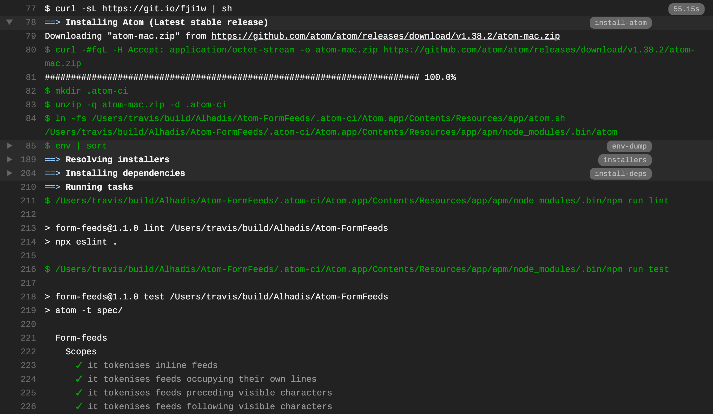

<!-- -*- tab-width: 4; -*- vim: set ts=4 noet: -->

Atom CI
=======
[![Build status: TravisCI][TravisCI-badge]][TravisCI-link]

This is a script for setting up continuous integration with an Atom project.

[][Live-example]

Usage
-----
Run the following command:

~~~sh
curl -sL https://git.io/fji1w | sh
~~~

This should work on any Unix-like system, irrespective of whether it's invoked by a CI server or directly from your terminal.
**Note that Windows is _not_ currently supported<!-- TODO: (see [below][Windows] for a workaround) -->.**

<dl><dt><a name="travis-ci" href="https://travis-ci.com">Travis CI</a></dt><dd>

Add the following line to your project's [`.travis.yml`][] file:

~~~yaml
script: curl -sL https://git.io/fji1w | sh
~~~

</dd><dt><a name="github-actions" href="https://docs.github.com/en/actions/reference">GitHub Actions</a></dt><dd>

Add a step to your project's workflow to execute the aforementioned command:

~~~yaml
steps:
  - name: Run package tests
    run: curl -sL https://git.io/fji1w | sh
~~~

A more complete—and working—workflow example can be found [here](`.github/workflows/ci.yml`).

</dd></dt>

Features
--------
It's fundamentally the same as [`atom/ci`][], with the following differences:

1.	__GitHub's release pages are consulted directly for downloads.__  
	This is a tad bit slower than downloading from [`atom.io`][],
	but it means sudden changes to their infrastructure won't break your build.

2.	__Arbitrary release channels (`dev`, `nightly`) are unsupported.__  
	Only `stable` and `beta` releases of Atom can be tested against. However, users
	can set `$ATOM_RELEASE` in their environment to build against an arbitrary Atom
	version:
	~~~yaml
	env:
	  - ATOM_CHANNEL=stable   # Latest stable release (default)
	  - ATOM_RELEASE=v1.34.0  # Override ATOM_CHANNEL and test specific version
	~~~

3.	__Only [Travis CI][] and [GitHub Actions][] are supported for now.__

4.	__`lint` or `test` scripts defined in `package.json` are used, if possible.__  
	If your package manifest defines a `lint` or `test` script, the CI script will
	call those instead. For example:
	~~~json
	{
		"scripts": {
			"lint": "npx eslint --ext mjs,js ./lib/ ./tools",
			"test": "atom -t ./specs"
		}
	}
	~~~
	If you don't specify a script, the usual defaults assumed by [`atom/ci`][] are
	attempted instead:
	~~~shell
	# Linting
	DIRS="./lib ./src ./spec ./test"
	npx coffeelint $DIRS
	npx eslint $DIRS
	npx tslint $DIRS

	# Testing
	DIRS="./spec ./specs ./test ./tests"
	atom --test $DIRS
	~~~
	Note that only linters listed in `devDependencies` will be run, and missing
	directories will be skipped. However, at least one test directory *must* be
	included, or else the build will fail.

Testing on Ubuntu
-----------------
If you're running builds on Ubuntu, be forewarned that Atom's beta channel may
give `dpkg` an archive [it can't unpack](https://github.com/atom/ci/issues/94)
due to [a bug](https://askubuntu.com/q/1065231/) with older versions of `dpkg`.
The solution is to run builds on Xenial instead of Trusty, which requires that
you include `libgconf2-4` as a dependency:

~~~diff
@@ .travis.yml @@
 addons:
   apt:
     packages:
     - build-essential
     - fakeroot
     - git
+    - libgconf2-4
     - libsecret-1-dev
~~~

To-do list
----------
*	[ ] **Support the `atom-mocha` executable, once it can be run globally**  

*   [ ] **Support nested groups in GitHub Actions, if/when it becomes possible**

*	[ ] **Learn PowerShell and write a version of this for [AppVeyor][]**  
	Not a huge priority at the moment, as the AppVeyor integration provided
	by [`atom/ci`][] is currently working fine.

Background
--------------------------------------------------------------------------------
On July 6th 2019 AEST, Atom's CI script suddenly broke. The culprit was botched
handling of a [`curl(1)`](https://curl.haxx.se/docs/manpage.html) request which
included an `Accept` header:

~~~console
$ curl -L "https://atom.io/download/mac?channel=${ATOM_CHANNEL}" \
	-H 'Accept: application/octet-stream' \
	-o "atom.zip"
######################################################################## 100.0%
curl: (22) The requested URL returned error: 406 Not Acceptable
~~~

Following the URL simply lead to
Atom's [releases page](https://github.com/atom/atom/releases/latest) on GitHub.
I was unsure what the link usually pointed to, but having this break the builds
of each of my projects was certainly *not* the intended outcome.

Since I'm blocked from the @atom org on GitHub, I was unable to report this or
submit a pull-request. So, as usual, I took things into my own hands.

<!-- Referenced links -->
[APIs]: https://developer.github.com/v3/repos/releases/
[Live-example]: https://travis-ci.org/Alhadis/Atom-FormFeeds/jobs/556455405#L78
[TravisCI-badge]: https://travis-ci.org/Alhadis/Atom-CI.svg?branch=master
[TravisCI-link]:  https://travis-ci.org/Alhadis/Atom-CI
[`.travis.yml`]: https://docs.travis-ci.com/user/tutorial
[`atom/ci`]: https://github.com/atom/ci
[`atom.io`]: https://atom.io/
[Travis CI]: https://travis-ci.com/
[AppVeyor]: https://appveyor.com/
[GitHub Actions]: https://docs.github.com/en/actions/reference
