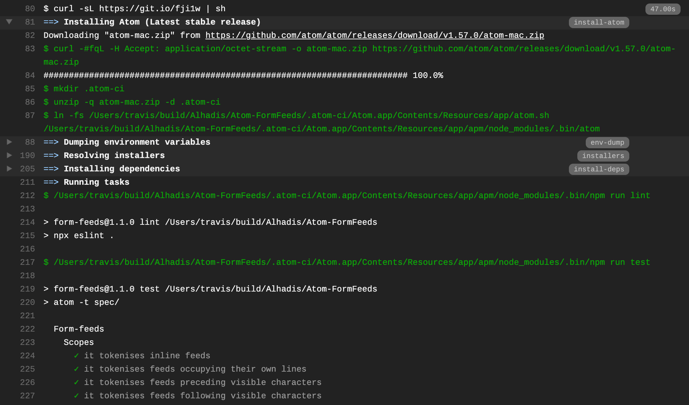

<!-- -*- tab-width: 4; -*- vim: set ts=4 noet: -->

Atom CI
=======
[![Build status: GitHub Actions][Actions-badge]][Actions-link]
[![Build status: Travis CI][TravisCI-badge]][TravisCI-link]

This is a script for setting up continuous integration with an Atom project.

[][Live-example]

Usage
-----

#### [Travis CI][] ####
Add the following line to your project's [`.travis.yml`][] file:

~~~yaml
script: curl -sL https://git.io/fji1w | sh
~~~

#### [GitHub Actions][] ####
Add one or both of the following steps to your project's workflow:

~~~yaml
steps:
  - name:  Run package tests (macOS, Linux)
    if:    ${{ startsWith(matrix.os, 'macOS') || startsWith(matrix.os, 'Ubuntu') }}
    run:   curl -sL https://git.io/fji1w | sh
    shell: sh

  - name:  Run package tests (Windows)
    if:    ${{ startsWith(matrix.os, 'Windows') }}
    run:   (New-Object net.WebClient).DownloadString("https://git.io/JWdh6") | iex
    shell: powershell
~~~

A more complete workflow example can be found [here](`.github/workflows/ci.yml`).

Features
--------
It's fundamentally the same as [`atom/ci`][], with the following differences:

1.	__GitHub's release pages are consulted directly for downloads.__  
	This is a tad bit slower than downloading from [`atom.io`][],
	but it means sudden changes to their infrastructure won't break your build.

2.	__Arbitrary release channels (`dev`, `nightly`) are unsupported.__  
	Only `stable` and `beta` releases of Atom can be tested against. However, users
	can set `$ATOM_RELEASE` in their environment to build against an arbitrary Atom
	version:
	~~~yaml
	env:
	  - ATOM_CHANNEL=stable   # Latest stable release (default)
	  - ATOM_RELEASE=v1.34.0  # Override ATOM_CHANNEL and test specific version
	~~~

3.	__Only [Travis CI][] and [GitHub Actions][] are supported for now.__

4.	__`lint` or `test` scripts defined in `package.json` are used, if possible.__  
	If your package manifest defines a `lint` or `test` script, the CI script will
	call those instead. For example:
	~~~json
	{
		"scripts": {
			"lint": "npx eslint --ext mjs,js ./lib/ ./tools",
			"test": "atom -t ./specs"
		}
	}
	~~~
	If you don't specify a script, the usual defaults assumed by [`atom/ci`][] are
	attempted instead:
	~~~shell
	# Linting
	DIRS="./lib ./src ./spec ./test"
	npx coffeelint $DIRS
	npx eslint $DIRS
	npx tslint $DIRS

	# Testing
	DIRS="./spec ./specs ./test ./tests"
	atom --test $DIRS
	~~~
	Note that only linters listed in `devDependencies` will be run, and missing
	directories will be skipped. However, at least one test directory *must* be
	included, or else the build will fail.

Testing on Ubuntu
-----------------
If you're running builds on Ubuntu, be forewarned that Atom's beta channel may
give `dpkg` an archive [it can't unpack](https://github.com/atom/ci/issues/94)
due to [a bug](https://askubuntu.com/q/1065231/) with older versions of `dpkg`.
The solution is to run builds on Xenial instead of Trusty, which requires that
you include `libgconf2-4` as a dependency:

~~~diff
@@ .travis.yml @@
 addons:
   apt:
     packages:
     - build-essential
     - fakeroot
     - git
+    - libgconf2-4
     - libsecret-1-dev
~~~

To-do list
----------
* [ ] **Support the `atom-mocha` executable, once it can be run globally**
* [ ] **Support an environment variable for specifying package's root directory**
* [ ] **Test PowerShell version on Linux**
* [ ] **Use GitHub's `[command]` syntax for echoing external commands**
* [ ] **Make POSIX version's `$PATH` tampering consistent with PowerShell's**
* [ ] **Document and dogfood AppVeyor usage**

Background
--------------------------------------------------------------------------------
On July 6th 2019 AEST, Atom's CI script suddenly broke. The culprit was botched
handling of a [`curl(1)`](https://curl.haxx.se/docs/manpage.html) request which
included an `Accept` header:

~~~console
$ curl -L "https://atom.io/download/mac?channel=${ATOM_CHANNEL}" \
	-H 'Accept: application/octet-stream' \
	-o "atom.zip"
######################################################################## 100.0%
curl: (22) The requested URL returned error: 406 Not Acceptable
~~~

Following the URL simply lead to
Atom's [releases page](https://github.com/atom/atom/releases/latest) on GitHub.
I was unsure what the link usually pointed to, but having this break the builds
of each of my projects was certainly *not* the intended outcome.

Since I'm blocked from the [**@atom**](https://github.com/atom) org on GitHub,
I was unable to report this or submit a pull-request. So I took things into my
own hands, as usual.

<!-- Referenced links -->
[APIs]: https://developer.github.com/v3/repos/releases/
[Live-example]:   https://app.travis-ci.com/github/Alhadis/Atom-FormFeeds/jobs/523013011#L80
[Actions-badge]:  https://img.shields.io/github/workflow/status/Alhadis/Atom-CI/Atom%20CI?label=GitHub%20Actions&logo=github
[Actions-link]:   https://github.com/Alhadis/Atom-CI/actions
[TravisCI-badge]: https://img.shields.io/travis/com/Alhadis/Atom-CI?label=Travis%20CI&logo=travis
[TravisCI-link]:  https://travis-ci.com/Alhadis/Atom-CI
[`.travis.yml`]: https://docs.travis-ci.com/user/tutorial
[`atom/ci`]: https://github.com/atom/ci
[`atom.io`]: https://atom.io/
[Travis CI]: https://travis-ci.com/
[AppVeyor]: https://appveyor.com/
[GitHub Actions]: https://docs.github.com/en/actions/reference
